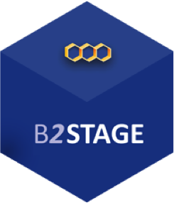
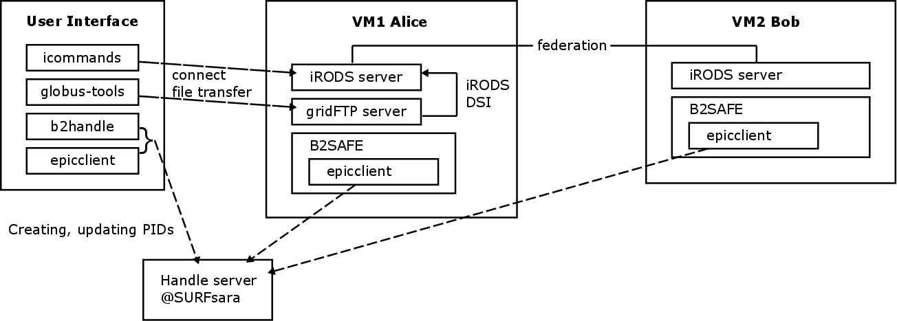

# B2SAFE-B2STAGE-Training

## Contents
This training module provides hands-on material for iRODS4, EUDAT B2SAFE, the epicclient (based on handle version 8) and
[B2STAGE](https://github.com/WillemElbers/B2SAFE-GridFTP).

We provide install files which indicate how the training machines are setup and which will give the users an idea how to
install the software stack temselves.
The training material itself is targeted at users (scientists) and site admins.
The order of the markdown files proposes the curriculum of the training. Each component takes about 1 hour.

File | Target audience
------|-------------------
00-install-iRODS4.md | site admins
01-iRODS-handson-user.md | researchers
02-iRODS-handson-admin.md	| site admins and interested researchers
03-install-B2SAFE.md	| site admins
04-iRODS_federations_configuration.md	| site admins and interested researchers
05-iRODS-advanced-users.md	| site admins and researchers
06-B2SAFE-handson.md	| site admins and data managers
07\*-Working-with-PIDs_\*.md | site admins and interested researchers
08-install-B2STAGE.md | site admins
09-using-B2STAGE.md | researchers, last exercise is a joint effort between researchers and site admins

## Setup
During the tutorial site admins and users will jointly setup an infrastructure like indicated in the picture below.

### Users - Training
Users can get access to a setup of virtual machines (VMs) like above. The tutorial will show them the functionality of single components and how to combine them in order to arrive at proper data management.
Users can either choose to setup their personal computer to resemble the user interface machine or they can receive a login on a user interface VM.
Via the user interface machine they can access the first VM which contains an iRODS server, a gridFTP server, and the B2SAFE module.
Another VM holds another iRODS server. Both iRODS grids are federtated and users can transfer data from one grid to the other.
The client VM also provides the necessary python libraries to work with the *epicclient* and b2handle.

### Site admins - Training
Site admins will be guided through all steps to setup the environment, covering iRODS installation and federation, setting up B2SAFE, deploying a gridFTP endpoint and pointing it to the iRODS server via the data staging interface.

### Persistent identifiers (PIDs)
In the tutorial we will explain how to create, update and delete PIDs. The infrastructure to manage PIDs is provided by SURFsara.
Note that all instances (B2SAFE, user modules) will make use of the same PID prefix.

