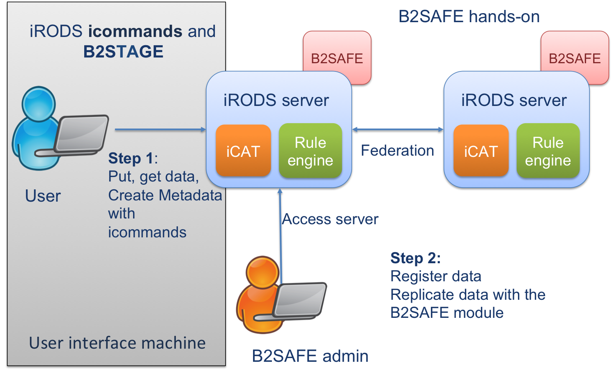

# Setting up an iRODS federation and replicate data with B2SAFE
This hands-on takes you through the configuration steps necessary to set up an iRODS federation. Subsequently, we illustrate how to use the B2SAFE rules to register data and replicate this data to another iRODS zone.

## Prerequisites
Two iRODS 4.1 zones enabled with B2SAFE 2.
Please refer to [B2SAFE](https://github.com/chStaiger/B2SAFE-B2STAGE-Training/blob/master/install_B2SAFE.md) 
 and [iRODS4](https://github.com/chStaiger/B2SAFE-B2STAGE-Training/blob/master/install_iRODS4.md)

## Configuring the iRODS federation
### Creating remote zones and users
Assume we have to iRODS servers aliceZone with alice as irodsadmin and bobZone with bob as irodsadmin.
- We need to create remote zones on the respective machines, i.e. on aliceZone we need to create a remote zone for bobZone and vice versa.
* on aliceZone do
```sh
iadmin mkzone bobZone remote <full hostname or ipadress>:1247
```
Note that you cannot rename bobZone, it needs to be exactly the same zone name on the iRODS server you would like to federate with.
* on bobZone do
```sh
iadmin mkzone aliceZone remote <full hostname or ipadress>:1247
```

- Next we need to grant access to alice on bobZone as rodsuser 
```sh
iadmin mkuser alice#aliceZone rodsuser
```
The '#' denotes the zone where the user 'alice' is known and authenticated. 
'rodsuser' gives alice user rights. With
```sh
iadmin lt user_type
```
you can check which other user types are known in iRODS.

- Same for bob on aliceZone
```sh
iadmin mkuser bob#bobZone rodsuser
```
However, this is not enough to set up the federation. If you now try to have a look into *bob*'s folder on *aliceZone* you receive the following error:
```sh
bob@irods4:~$ ils /aliceZone
ERROR: rcObjStat of /aliceZone failed status = -913000 REMOTE_SERVER_SID_NOT_DEFINED
```

### Editing the config files
- To make both sites known to each other and to authenticate we need to edit the field 'federations' in /etc/irods/server_config.json
On boZone insert:
```sh
"federation": [
        {
        "icat_host": "ipadress or full hostname",
        "zone_name": "aliceZone",
        "zone_key": "alice_zone_key",
        "negotiation_key": "TEMPORARY_32byte_negotiation_key"
    }
```
You will find all necessay information to fill in this information in the server_config.json on aliceZone.
On aliceZone insert:
```sh
"federation": [
        {
        "icat_host": "ipadress or full hostname",
        "zone_name": "bobZone",
        "zone_key": "bob_zone_key",
        "negotiation_key": "TEMPORARY_32byte_negotiation_key"
    }
]
```

- In some cases you will also have edit the /etc/irods/hosts_config.json
This is the case if you encounter the following error after editing the server_config.json you will have to go through another step.
```sh
bob@irods4:~$ ils /aliceZone/home/bob#bobZone
ERROR: connectToRhost: error returned from host localhost status = -38000 status = -38000 SYS_AGENT_INIT_ERR
ERROR: _rcConnect: connectToRhost error, server on localhost:1247 is probably down status = -38000 SYS_AGENT_INIT_ERR
```
Open the hosts_config.json and enter on aliceZone the addresses of you local zone and the remote zone (bobZone):
```sh
{
    "host_entries": [
{
            "address_type" : "remote",
            "addresses" : [
                   {"address" : "145.100.58.24"}, #ip address
                   {"address" : "iRODS4-bob.eudat-sara.vm.surfsara.nl"}, #full server name
                   {"address" : "irods4.bob"} #hostname
             ]
        },
        {
            "address_type" : "local",
            "addresses" : [
                   {"address" : "145.100.58.12"},
                   {"address" : "iRODS4-alice.eudat-sara.vm.surfsara.nl"},
                   {"address" : "iRODS4.alice"}
             ]
        }
]
}
```
Do the same on bobZone and restart the iRODS servers as *root*.

```sh
service irods restart
```

After logging into irods again on bobZone you are now able to list your folders and files on aliceZone:
```sh
iinit
bob@irods4:~$ ils /aliceZone/home/bob#bobZone
/aliceZone/home/bob#bobZone:
```

## Moving files between irods zones (Testing the federation)

## B2SAFE data transfer workflow (Using B2SAFE)

 
